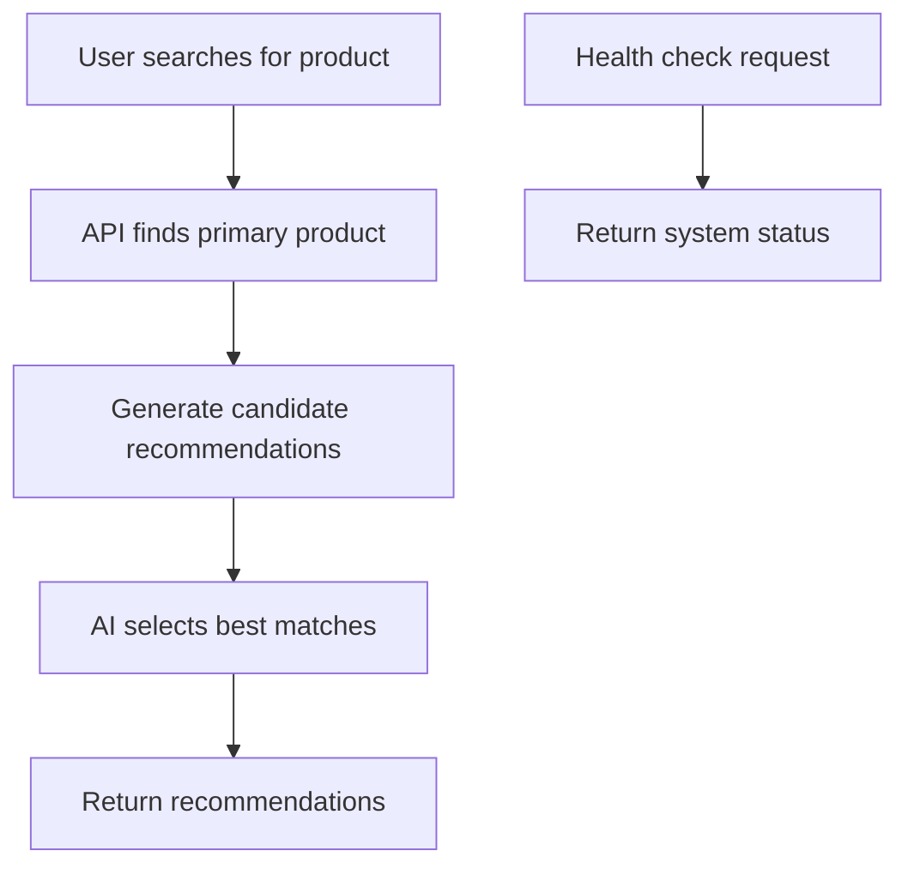

#python -m uvicorn app.main:app --reload --port 8000

# Recommendation Agent API

An AI-powered product recommendation system built with FastAPI, Google Gemini, and configurable data sources (JSON/MongoDB).

## Overview

This project implements a recommendation agent that uses Google's Gemini AI to suggest relevant product accessories and complements based on user queries. The system supports multiple phone brands and models, providing intelligent recommendations for cases, chargers, screen protectors, and other accessories.

## Project Structure

The project has been reorganized into a clear folder structure:

```
recommendation_agent/
├── app/                  # FastAPI application code
│   ├── main.py           # API endpoints and core logic
│   ├── config.py         # Configuration loading
│   └── mongo_repository.py # Data repository layer
│
├── data/                 # Data files and configuration
│   ├── products.json     # Product database
│   ├── config.json       # Configuration settings
│   └── render.yaml       # Deployment configuration
│
├── models/               # Data models and schemas
│   ├── schemas.py        # Pydantic models
│   └── list_models.py    # Model listing utility
│
├── documents/            # Project documentation
│   ├── README.md         # Main documentation
│   └── agent_logic.md    # AI agent details
│
├── requirements.txt      # Python dependencies
├── .env                  # Environment variables
└── .venv/                # Virtual environment
```

## Key Changes in Refactor

1. **Modular Organization**: Code is now separated by concern:
   - `app/` contains all FastAPI application logic
   - `data/` holds JSON files and configuration
   - `models/` contains Pydantic schemas and model utilities
   - `documents/` stores all project documentation

2. **Updated Imports**: All imports now use the new folder structure:
   - `from app.mongo_repository import ...`
   - `from app import config`
   - `from models.schemas import Product, PublicProduct, ...`

3. **Configuration Paths**: Data file paths updated to point to `data/` directory

4. **Deployment Configuration**: `render.yaml` updated to use `app.main:app`

## Running the Refactored Application

```bash
# Set environment variables
export GEMINI_API_KEY="your_api_key"

# Run with uvicorn (note the new path)
uvicorn app.main:app --reload
```

## API Endpoints

The endpoints remain the same but now use the refactored structure:

### GET /health
Returns system health status including data source and Gemini model configuration.

### POST /recommendations
Generates product recommendations based on item name.

## Configuration

Configuration files are now located in the `data/` directory:

- `data/config.json`: Main configuration
- `data/products.json`: Product database
- `data/render.yaml`: Deployment settings

## Development

The refactored structure makes development easier:

- **Models**: Add new Pydantic models in `models/schemas.py`
- **API**: Extend endpoints in `app/main.py`
- **Data**: Update products in `data/products.json`
- **Docs**: Maintain documentation in `documents/`

## Migration Notes

If you were using the old structure, update your commands:

- Old: `uvicorn main:app`
- New: `uvicorn app.main:app`

- Old: `from main import Product`
- New: `from models.schemas import Product`

The application functionality remains identical, just better organized!

## Architecture

### System Components

```
┌─────────────────┐    ┌──────────────────┐    ┌─────────────────┐
│   FastAPI       │    │  Gemini AI       │    │  Data Source    │
│   Application   │◄──►│  Recommendation  │◄──►│  (JSON/MongoDB) │
│                 │    │  Engine          │    │                 │
└─────────────────┘    └──────────────────┘    └─────────────────┘
         │                       │                       │
         ▼                       ▼                       ▼
┌─────────────────┐    ┌──────────────────┐    ┌─────────────────┐
│   API Endpoints │    │  Candidate       │    │  Product        │
│   (/health,     │    │  Builder         │    │  Repository     │
│    /recommend)  │    │                  │    │                 │
└─────────────────┘    └──────────────────┘    └─────────────────┘
```

### Core Logic Flow

1. **User Query Processing**: API receives product name via `/recommendations` endpoint
2. **Product Lookup**: Searches data source for exact/partial name matches
3. **Candidate Generation**: Builds list of potential recommendations using rule-based logic
4. **AI Selection**: Gemini AI evaluates candidates and selects most relevant items
5. **Response Formatting**: Returns primary product and recommendations

## Use Cases

### Primary Use Cases



### Detailed Use Case: Product Recommendation

**Actor**: End User / API Consumer

**Preconditions**:
- Service is running
- Gemini API key is configured
- Product data is available

**Main Flow**:
1. User sends POST request to `/recommendations` with `item_name` and optional `limit`
2. System searches for product by exact or partial name match
3. If product found, system generates candidate recommendations using business rules
4. Gemini AI evaluates candidates and selects top recommendations
5. System returns primary product and recommendation list

**Alternative Flows**:
- **Product Not Found**: Return empty recommendations
- **No Candidates**: Return primary product only
- **AI Failure**: Fall back to deterministic selection (first N candidates)

**Postconditions**:
- User receives JSON response with recommendations
- System logs request for monitoring

## Agent Involvement and Logic

### AI Agent Role

The Gemini AI agent serves as the intelligent recommendation selector, replacing simple rule-based filtering with contextual understanding. The agent:

- **Analyzes Product Context**: Considers category, brand, model, attributes, and tags
- **Understands Relationships**: Recognizes accessory compatibility (e.g., phone cases, chargers)
- **Makes Contextual Decisions**: Selects items based on relevance rather than rigid rules
- **Handles Edge Cases**: Adapts to new product types and relationships

### Recommendation Logic

#### Candidate Builder (`build_candidates`)

**Phone-Specific Logic**:
- **Cases/Screen Guards**: Match exact `compatible_model` and `compatible_brand`
- **Chargers**: Match `port_type` and `compatible_brand` (or "universal")
- **Generic Complements**: Same brand or overlapping tags

**Fallback Strategy**:
- If AI fails (quota, network issues), use deterministic selection
- Return first `limit` candidates as simple fallback

#### AI Selection Process

**Prompt Structure**:
- Primary product details (JSON format)
- Candidate list (JSON array)
- Selection criteria and constraints
- Required JSON response format

**Selection Criteria**:
- Relevance based on category, brand, model, attributes, tags
- Accessory compatibility
- Use-case complementarity
- Brand consistency where appropriate

### Data Flow

```
User Request
    ↓
Product Search (exact/partial match)
    ↓
Candidate Generation (rule-based filtering)
    ↓
AI Evaluation (Gemini prompt)
    ↓
Recommendation Selection
    ↓
Response Formatting
```

## API Endpoints

### GET /health
Returns system health status including data source and Gemini model configuration.

**Response**:
```json
{
  "status": "healthy",
  "data_source": "json",
  "gemini_model": "models/gemini-2.0-flash-exp"
}
```

### POST /recommendations
Generates product recommendations based on item name.

**Request Body**:
```json
{
  "item_name": "Samsung Galaxy A57",
  "limit": 5
}
```

**Response**:
```json
{
  "primary_item": {
    "id": 101,
    "name": "Samsung Galaxy A57",
    "category": "phone",
    "brand": "Samsung",
    "model": "A57"
  },
  "recommendations": [
    {
      "id": 201,
      "name": "Samsung A57 Shockproof Pouch",
      "category": "phone_case",
      "brand": "Samsung",
      "model": "A57"
    }
  ]
}
```

## Configuration

### Environment Variables
- `GEMINI_API_KEY`: Required Google Gemini API key
- `GEMINI_MODEL`: Primary Gemini model (default: "models/gemini-2.0-flash-exp")
- `GEMINI_FALLBACK_MODEL`: Backup model for reliability

### Config File (config.json)
```json
{
  "GEMINI_MODEL": "models/gemini-2.0-flash-exp",
  "GEMINI_FALLBACK_MODEL": "models/gemini-1.5-flash",
  "USE_MONGO": false,
  "MONGO_URI": "mongodb://localhost:27017",
  "MONGO_DB": "recommendation_db",
  "MONGO_COLLECTION": "products",
  "PRODUCTS_FILE": "products.json"
}
```

## Data Sources

### JSON File (Default)
- Products stored in `products.json`
- Simple file-based storage for development/testing
- No external dependencies

### MongoDB (Optional)
- Configurable via `USE_MONGO=true`
- Requires `pymongo` package
- Supports production-scale data storage

## Product Data Structure

```json
{
  "id": 101,
  "name": "Samsung Galaxy A57",
  "category": "phone",
  "brand": "Samsung",
  "model": "A57",
  "attributes": {
    "port_type": "usb_c",
    "os": "Android",
    "storage": "128GB"
  },
  "tags": ["phone", "android", "samsung", "A57"]
}
```

## Supported Product Categories

- **Phones**: Samsung, Apple, Google, OnePlus, Xiaomi, Motorola
- **Accessories**:
  - Phone cases (silicone, TPU, leather)
  - Screen protectors (tempered glass)
  - Chargers (wall, car, wireless)
  - Cables (USB-C, Lightning)
  - Earbuds/Earphones
  - Power banks
  - Car mounts

## Deployment

### Local Development
```bash
pip install -r requirements.txt
export GEMINI_API_KEY="your_api_key"
uvicorn main:app --reload

python -m uvicorn app.main:app --reload --port 8000
```

### Production (Render)
- Uses `render.yaml` for deployment configuration
- Automatic deployment on code changes
- Free tier available

## Error Handling

- **AI Service Unavailable**: Falls back to deterministic selection
- **Product Not Found**: Returns empty recommendations gracefully
- **Invalid Input**: FastAPI automatic validation and error responses
- **Database Connection Issues**: Graceful degradation with error logging

## Monitoring and Logging

- Request logging for API calls
- Health check endpoint for service monitoring
- Error logging for debugging AI failures
- Configurable data source status reporting

## Future Enhancements

- User preference learning
- A/B testing for recommendation algorithms
- Multi-language support
- Advanced filtering options
- Recommendation confidence scores
- Integration with e-commerce platforms