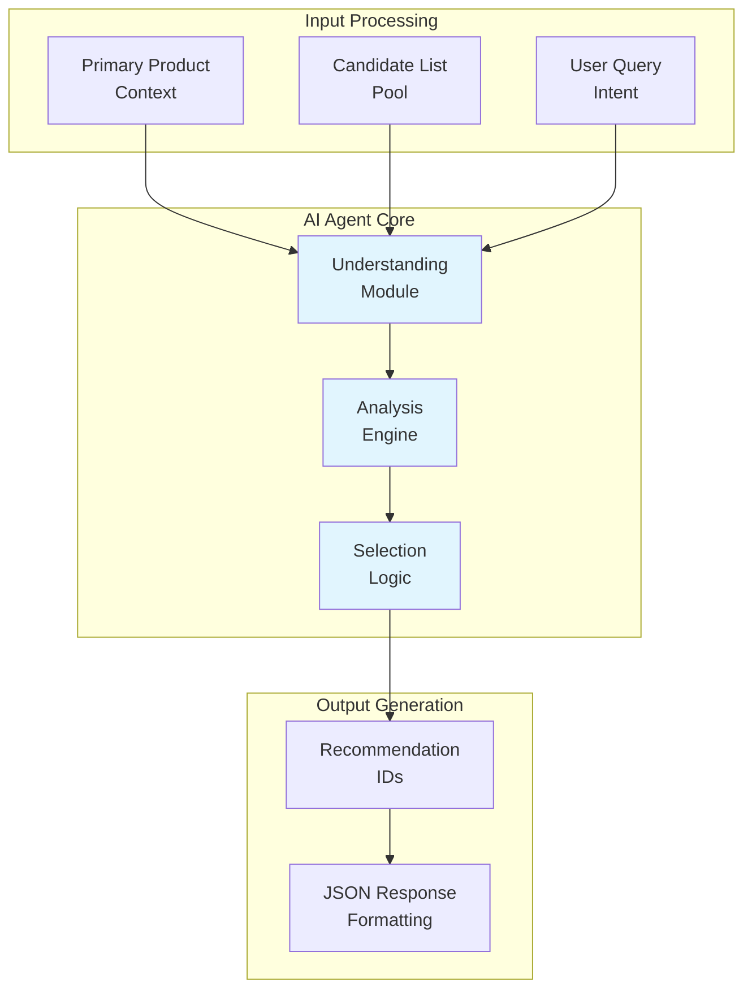
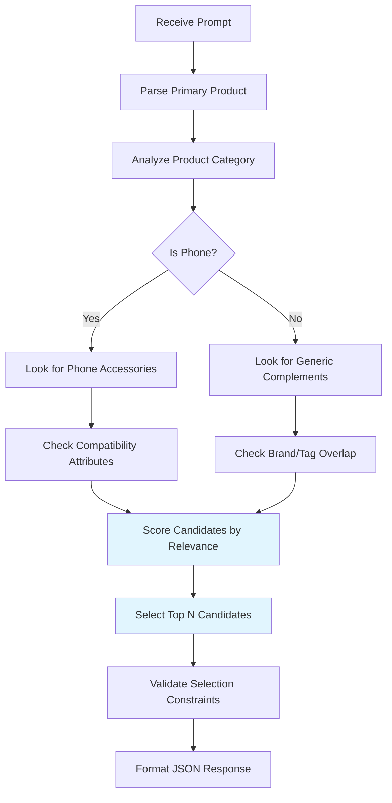
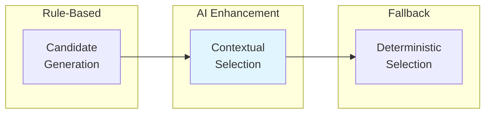

# AI Agent Logic and Involvement

## Overview

The Recommendation Agent uses Google Gemini AI as an intelligent selector to transform rule-based candidate generation into contextual, relevance-driven recommendations. The AI agent acts as the "brain" of the system, understanding product relationships and user intent beyond simple attribute matching.

## Agent Architecture



## Agent Prompt Engineering

### Primary Prompt Structure

```
You are a product recommendation engine.

Primary product:
{primary_product_json}

Candidate products (the ONLY products you can choose from):
{candidate_products_json_array}

Your task:
- Select up to {limit} products from the candidate list that are relevant recommendations.
- Relevance can be accessories, complements, or similar items based on category, brand, model, attributes, tags, or use-case.
- Use ONLY product IDs that appear in the candidate list.
- Do NOT invent new IDs or products.

Return ONLY valid JSON in this exact format:
{
  "primary_item_id": <number>,
  "recommendation_ids": [<number>, ...]
}
```

### Agent Capabilities

1. **Contextual Understanding**
   - Recognizes product categories and their typical accessories
   - Understands brand ecosystems (e.g., Apple ecosystem, Samsung ecosystem)
   - Interprets technical specifications (ports, compatibility)

2. **Relationship Inference**
   - Phone → Cases, screen protectors, chargers
   - Brand consistency for accessories
   - Universal vs. brand-specific compatibility

3. **Relevance Scoring**
   - Primary attribute matching (model, brand)
   - Secondary attribute consideration (tags, use cases)
   - Contextual appropriateness

## Decision Logic Flow



## Agent Involvement Points

### 1. Candidate Evaluation
- **Input**: Primary product + candidate list
- **Process**: AI analyzes each candidate's relevance
- **Output**: Ranked list of recommendation IDs

### 2. Contextual Adaptation
- **Brand Awareness**: Prefers brand-matched accessories when available
- **Category Intelligence**: Understands what accessories are appropriate for each product type
- **Compatibility Logic**: Recognizes technical compatibility requirements

### 3. Fallback Handling
- **Quota Management**: Graceful degradation when API limits are reached
- **Error Recovery**: Deterministic fallback ensures service reliability
- **Quality Assurance**: Validates selections against business rules

## Agent Training and Behavior

### Implicit Training Data
- **Product Knowledge**: Learns from structured product data
- **Category Patterns**: Recognizes common accessory relationships
- **Brand Associations**: Understands ecosystem relationships

### Behavioral Patterns
- **Conservative Selection**: Only chooses from provided candidates
- **Relevance Focus**: Prioritizes highly relevant items over quantity
- **Context Awareness**: Considers user intent from primary product context

## Performance Characteristics

### Strengths
- **Contextual Intelligence**: Goes beyond rule-based matching
- **Adaptability**: Can handle new product types without code changes
- **Natural Language Understanding**: Interprets product relationships intuitively

### Limitations
- **API Dependency**: Requires external service availability
- **Cost Considerations**: Each recommendation incurs API usage costs
- **Deterministic Fallback**: May lose intelligence when AI is unavailable

## Integration Points

### With Rule-Based System


### Error Handling Strategy
1. **Primary AI Call**: Attempt with preferred model
2. **Fallback Model**: Try secondary model if primary fails
3. **Deterministic Backup**: Use rule-based selection if all AI calls fail
4. **Logging**: Record failures for monitoring and improvement

## Future Agent Enhancements

### Advanced Capabilities
- **User Preference Learning**: Adapt to individual user patterns
- **Multi-Product Recommendations**: Suggest bundles or packages
- **Price-Aware Selection**: Consider budget constraints
- **Seasonal/Contextual Recommendations**: Time-based suggestions

### Technical Improvements
- **Prompt Optimization**: Refine prompts for better accuracy
- **Model Fine-Tuning**: Custom training on product data
- **Caching Strategies**: Reduce API calls for common queries
- **Batch Processing**: Handle multiple recommendations efficiently